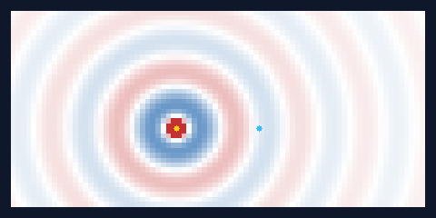
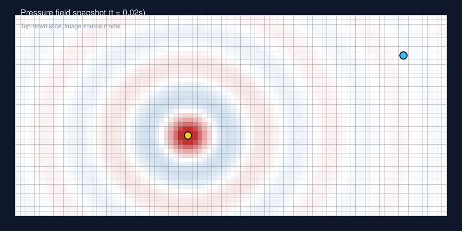
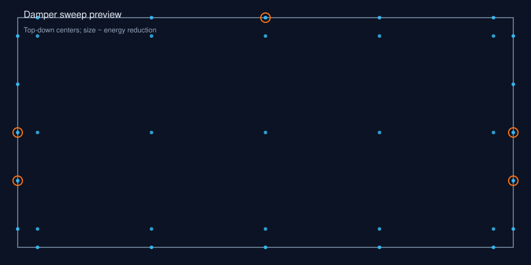

# Soundwaves

Room acoustics exploration with an image-source simulation, 3D pressure-field visualization, and acoustic metrics. The notebook drives the workflow: configure the room, run the simulation, analyze the impulse response, and evaluate wall damper placement.

## Highlights
- Image-source reflections with configurable order and wall absorption.
- 3D pressure-field animations (isosurface, slice, sparse, volume).
- Impulse response + RT60/clarity metrics and octave-band analysis.
- Damper placement sweeps with energy reduction summaries.

## Results at a glance






## Quick start
1) Create and activate a Python 3.10+ environment.
2) Install dependencies:
   ```bash
   pip install -r requirements.txt
   ```
3) Launch the notebook:
   ```bash
   jupyter notebook room_simulation.ipynb
   ```

## What gets generated
The notebook writes interactive HTML animations and CSV summaries into `result/`. These outputs are generated artifacts and are ignored by git. Use the previews in `docs/` for quick sharing, and re-run the notebook to regenerate the full interactive outputs locally.

## Simulation setup (current run)
| Parameter | Value |
|---|---|
| Room size (m) | 10.0 x 5.0 x 2.7 |
| Grid (nx, ny, nz) | 100 x 50 x 27 |
| Duration / dt | 0.1 s / 1/2000 s |
| Reflection order | 2 |
| Wall absorption | 0.2 |
| Attenuation | 0.01 |
| Source | guitar_amp_spectrum (80-44k Hz, 12 bands) |
| Source position (m) | (4.0, 2.0, 0.5) |
| Receiver position (m) | (6.0, 2.0, 1.8) |

## Project structure
- `room_simulation.ipynb` — end-to-end demo and reporting.
- `soundwaves/` — simulation core, analysis utilities, and visualization helpers.
- `docs/` — preview images for README and sharing.
- `result/` — generated outputs for a specific run (ignored by git).

## Notes
- Larger grids and higher reflection orders increase runtime quickly.
- The simulation uses a simplified image-source model and does not include diffraction.
